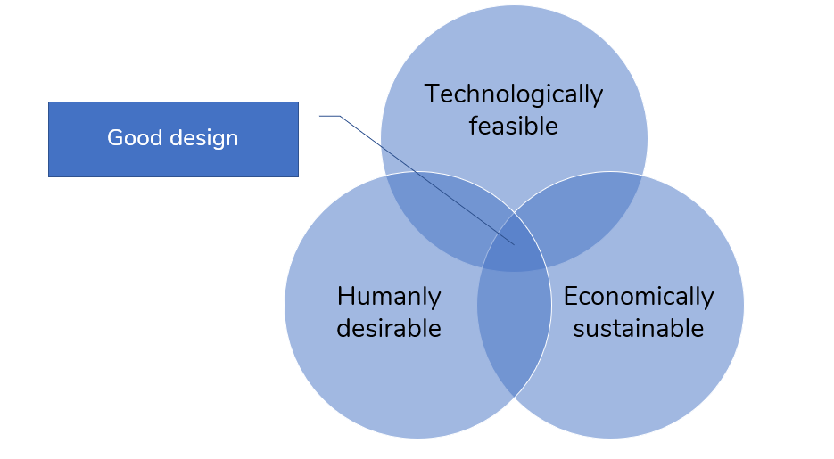

# 1. Introduction to human-centered design to tackle wicked problems

During this course, you will, in a team, tackle a real-world problem put forward by a client. To do so, we will use a methodology called **human-centered design**. The rationale behind this methodology is that good design is built on three important elements:

* The design is **technically feasible**.
* The design is **economically sustainable**.
* And, most importantly, the design is **desired and adopted by its intended users**.

More information on this concept can be found via the following links:

* [How to prototype a new business](https://www.ideou.com/blogs/inspiration/how-to-prototype-a-new-business), IDEO.
* [Desirability, Feasibility, Viability: The Sweet Spot for Innovation](https://medium.com/innovation-sweet-spot/desirability-feasibility-viability-the-sweet-spot-for-innovation-d7946de2183c), Kristann Orton.

Human-Centered Design is a methodology to design products and services that hit this sweet spot of good design. We will do so by focussing on solutions that are _humanly desirable_. The following video by IDEO gives a short introduction to human-centered design.

{% embed data="{\"url\":\"https://www.youtube.com/watch?v=NBu1kkSCHfs\",\"type\":\"video\",\"title\":\"What is Human centered Design\",\"description\":\"Credit : http://www.designkit.org/\",\"icon\":{\"type\":\"icon\",\"url\":\"https://www.youtube.com/yts/img/favicon\_144-vfliLAfaB.png\",\"width\":144,\"height\":144,\"aspectRatio\":1},\"thumbnail\":{\"type\":\"thumbnail\",\"url\":\"https://i.ytimg.com/vi/NBu1kkSCHfs/maxresdefault.jpg\",\"width\":1280,\"height\":720,\"aspectRatio\":0.5625},\"embed\":{\"type\":\"player\",\"url\":\"https://www.youtube.com/embed/NBu1kkSCHfs?rel=0&showinfo=0\",\"html\":\"
<iframe src=\\\"https://www.youtube.com/embed/NBu1kkSCHfs?rel=0&amp;showinfo=0\\\" style=\\\"border: 0; top: 0; left: 0; width: 100%; height: 100%; position: absolute;\\\" allowfullscreen scrolling=\\\"no\\\"></iframe>
\",\"aspectRatio\":1.7778}}" %}

Perhaps you've heard about human-centered design before, perhaps not. But it's also possible that you've heard terms like _user-centered design, designing thinking_ and _design research_. These are all design and/or research philosophies that are based on the same principles. So, we will follow the human-centered design methodology in this course, but if you encounter any of these other methodologies you will discover many similarities.

