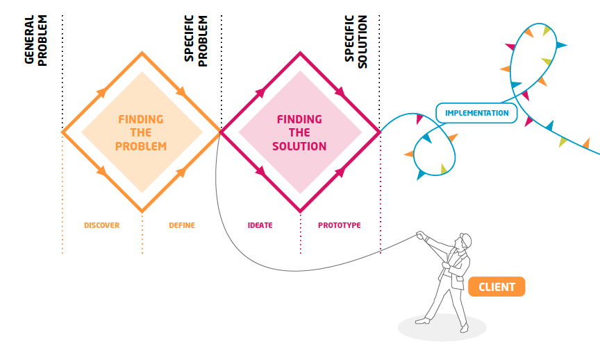

# Methodology

The human-centered design methodology consists of three main phases: a double diamond and an implementation phase.

The two diamonds each consists of a phase of divergence and convergence. In the coming modules, you will walk through the diamonds in more detail, but here is a short overview:

* **Diamond 1: Finding the problem.** One problem with design is that we often jump to solutions to quickly. In the first diamond, you're only investigating the problem - we're not thinking about solutions yet. We're going to try to understand the users, and find out what their problems really here. After all, often problems have underlying causes. You might think you're going to solve problem _x_, and find out along the way that the real problem to fix is _y_.
  * **Discover \(divergence\):** You're going to find out as much about the users and the problem as possible. Talk to people, observe them, try to really understand why they do things they way they do. Collect as much as possible.
  * **Define \(convergence\):** in this phase you're going to organise all the information you got into a limited amount of key problems you feel you need to tackle. Next, you're going to analyse these problems, and select one or a few you want to solve in the next diamond.
* **Diamond 2: Finding the solution.** Finally, you can start thinking about solutions in this phase! But thanks to the first diamond, your solutions will hopefully be more focussed towards the _real_ problems that need solving.
  * **Ideate \(divergence\):** Time to be quantitative again! Try to come up with as many ideas as possible that might solve the problem. Nothing is too crazy or ambitious, selection happens in the next phase.
  * **Prototype \(convergence\):** You're going to select a few solutions that seem both ambitious and realistic. You're going to make quick prototypes to test with your users. You will find out that some solutions don't work in practice, or need modifications. Learn and adopt! The idea is to cut down again and end up with only the best solutions.
* **Implementation.** We're not going to cover it in this course, but once you've found the best solutions, and you've tested them with real users, you can implement them. This means that you're going to turn them into real products, think about the business model, etc.

